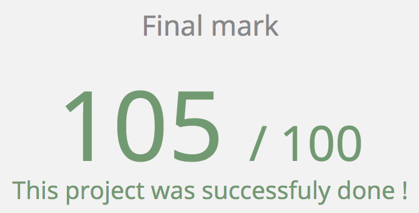
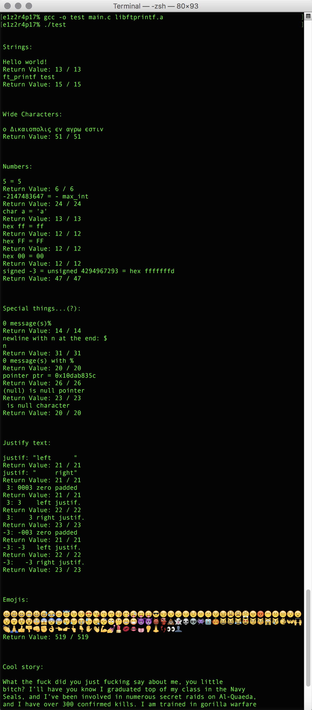

# École 42

## FT_Printf

This projects seeks to discover variadic functions in C in a particularly
relevant context, as well as to learn about a great example of a basic
“dispatcher” in C via the use of an array of function’s pointers. This projects
represents a good exercise in programming, because of printf's versatility in C.
The key to a successful ft_printf is a well-structured and good extensible code.

## TODO

* Specifiers: fF, eE, gG, aA, n
* Flags: $, L, '

## Getting Started

### Compiling

Run the following commands:

* To compile
	- `make`
* To remove objects:
	- `make clean`
* To remove objects and binary file (program):
	- `make fclean`
* To re-compile:
	- `make re`

### Executing

To test the library, first compile main.c with the library:

`gcc -o test main.c libftprintf.a`

`./test`

## Screenshots

**Testing the library:**

